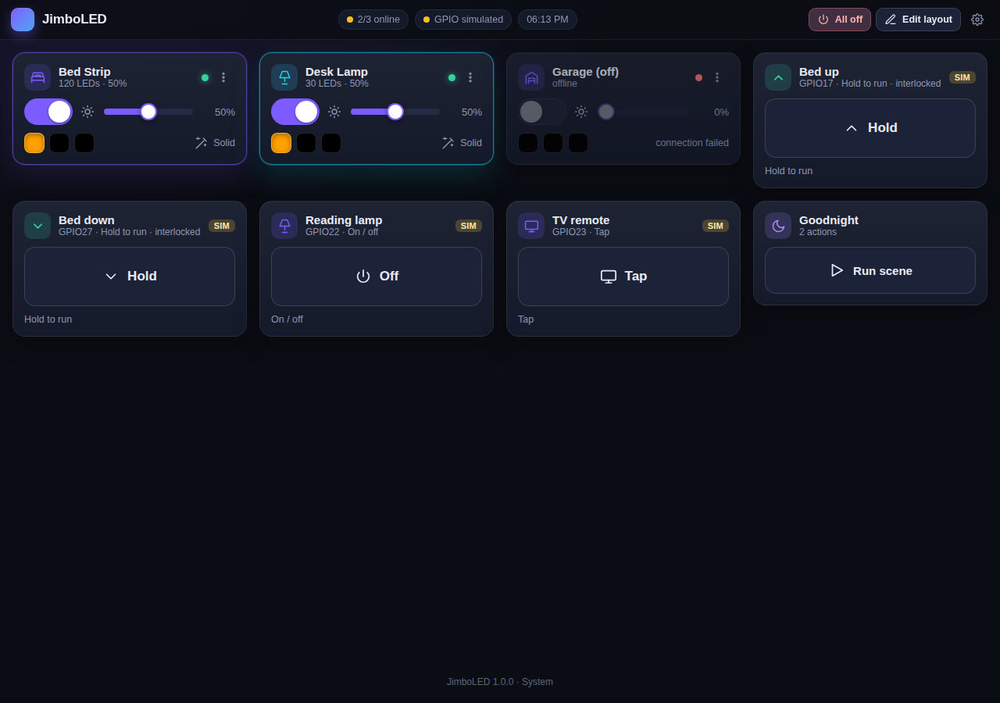
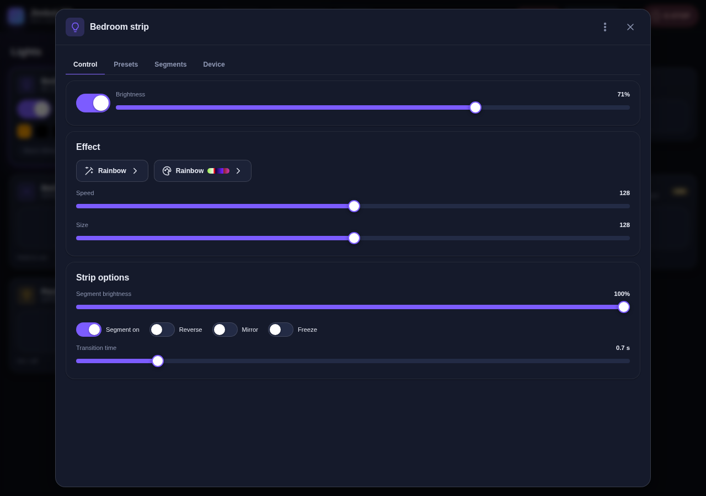
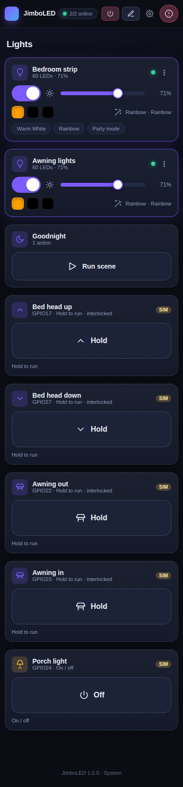

<p align="center">
  
</p>

<h1 align="center">JimboLED</h1>

<p align="center">
  A dark, phone‑friendly dashboard for your <a href="https://kno.wled.ge/">WLED</a> lights and the relays wired to a Raspberry Pi – for example the motor of an adjustable bed.<br>
  Runs on a Raspberry Pi Zero. Installs with one command. Nothing to build, no cloud, no accounts.
</p>

---

<p align="center">
  
</p>

## What it does

* **Controls any number of WLED controllers** – power, brightness, colours (incl. white / CCT), every effect with its own sliders and options, palettes, presets & playlists, segments, sleep timer, sync, reboot… Finds them on your network automatically.
* **Drives relays from the Pi's GPIO pins** – on/off switches, tap (pulse) buttons and *hold‑to‑run* buttons that only move a motor while your finger is on the screen. Built‑in safety rules (interlocks, time limits, watchdog) so an adjustable bed can never run away.
* **Customisable dashboard** – drag tiles into any order, resize, hide, rename, add headings, notes, a clock, and one‑tap **scenes** ("Goodnight" = all lights off + bed flat). Four dark themes and any accent colour.
* **Made for non‑technical users** – a setup wizard, plain‑language settings, confirmations where they matter, an **All off** panic button, automatic backups, one‑click updates.

## Install (Raspberry Pi)

1. Flash Raspberry Pi OS (Lite is fine) and connect the Pi to your Wi‑Fi.
2. Open a terminal on the Pi (or SSH in) and run:

```bash
git clone https://github.com/SethMorrowSoftware/JimboLED.git
cd JimboLED
sudo bash install.sh
```

3. Open **http://jimboled.local** (or the address the installer prints) from any phone, tablet or computer on the same network. The setup wizard finds your WLED lights and walks you through any switches.

The installer is **idempotent**: run it as often as you like. Your settings live in `/var/lib/jimboled` and are never touched by installs or updates.

Update later with `sudo bash update.sh` (or the *Check for updates* button in Settings → System). Remove with `sudo bash uninstall.sh`.

> **Tip:** on your phone, use *Add to Home Screen* – JimboLED then opens full‑screen like an app.

## Wiring relays (adjustable bed etc.)

See **[docs/WIRING.md](docs/WIRING.md)** for the full guide. The short version:

* Use a common opto‑isolated **5 V relay module**; power its coils from 5 V, its logic (VCC) from the Pi's 3.3 V, and connect each `IN` pin to a GPIO.
* Wire each relay's contacts **in parallel with a button of the bed's wired remote** (most beds: the remote just closes a low‑voltage contact). The bed's own control box keeps all its safety features; the original remote keeps working.
* In JimboLED, use the **Bed template** (Settings → Switches): two *hold‑to‑run* switches, interlocked so "up" and "down" can never be energised together, with a 60‑second limit.

<p align="center">
   
</p>

## Safety model

* Hold‑to‑run switches need a heartbeat from the browser every 0.4 s; if the phone locks, the tab closes, or Wi‑Fi drops, the relay releases within 1.5 s.
* Every switch can have a maximum on‑time. Hold‑to‑run switches always have one.
* Switches in the same **interlock group** are mutually exclusive, with a dead time between switching.
* All relays are released when JimboLED starts, stops, restarts, or crashes – and the installer records the pins in `config.txt` so they stay off from power‑on.
* **All off** in the header releases every relay and turns every light off at once.

## Running elsewhere (development)

JimboLED runs on any Linux/macOS/Windows machine; without GPIO hardware the switches run in *simulation* mode.

```bash
python3 -m venv .venv && . .venv/bin/activate
pip install -r requirements.txt
JIMBOLED_DATA_DIR=./data python -m jimboled --port 8080 --debug
```

Tests: `pip install pytest && pytest`. A fake WLED controller for demos: `python -m tests.fake_wled 8081`.

## Configuration & data

Everything is in one file: `/var/lib/jimboled/config.json` (or `./data/config.json` in development). Back it up from Settings → Backup. Automatic snapshots are kept in `backups/`.

| Setting | Where |
| --- | --- |
| Port, dashboard password | Settings → Security / System (or `server.port` in config.json) |
| Polling speed, time‑outs | Settings → Controllers |
| Relay safety (dead time, hold time‑out, GPIO driver) | Settings → Switches |
| Service overrides (`JIMBOLED_THREADS`, `GPIOZERO_PIN_FACTORY=mock`) | `/etc/jimboled/jimboled.env` |

## Troubleshooting

* **Can't open jimboled.local** – use the IP address instead (`hostname -I` on the Pi). Some Android browsers don't resolve `.local` names. The installer switches off Wi‑Fi power saving on the Pi, because it makes Pi Zeros miss the network broadcasts that `.local` names and WLED discovery rely on.
* **"JimboLED refused the address …"** – for safety the dashboard only answers to IP addresses, plain names and names ending in `.local`, `.lan`, `.home` and similar. If you gave the Pi a custom DNS name, add it under Settings → Security → Allowed names (or open it by IP once to do so).
* **A controller shows "offline"** – check it is powered and on the same Wi‑Fi; the tile tells you the last error. WLED's own page must open at `http://<its-ip>/`.
* **A relay clicks when it should be off (or the other way round)** – flip *Relay trigger* (active HIGH / active LOW) in the switch settings and use *Test this pin*.
* **"GPIO simulated"** in the header – the service couldn't open the GPIO hardware. Run `sudo bash install.sh` again and check `sudo journalctl -u jimboled -n 50`.
* **Logs** – Settings → System, or `sudo journalctl -u jimboled -f`.

## How it's built

Python 3.9+, Flask, waitress, requests, gpiozero (lgpio on Raspberry Pi OS Bookworm and newer). Vanilla JavaScript front end – no build step, no external CDNs, works offline on your LAN. See [docs/ARCHITECTURE.md](docs/ARCHITECTURE.md).

## License

MIT – see [LICENSE](LICENSE).
